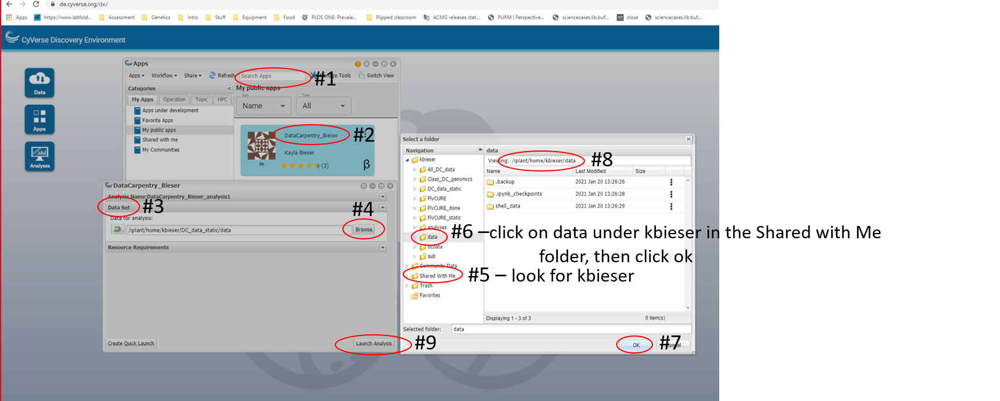
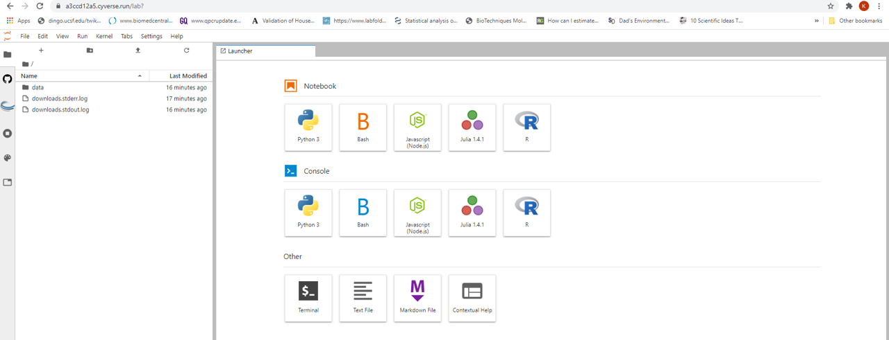

## What is a shell and why should I care?

A *shell* is a computer program that presents a command line interface
which allows you to control your computer using commands entered
with a keyboard instead of controlling graphical user interfaces
(GUIs) with a mouse/keyboard combination.

There are many reasons to learn about the shell:

* Many bioinformatics tools can only be used through a command line interface, or
have extra capabilities in the command line version that are not available in the GUI.
This is true, for example, of BLAST, which offers many advanced functions only accessible
to users who know how to use a shell.
* The shell makes your work _less boring_. In bioinformatics you often need to do
the same set of tasks with a large number of files. Learning the shell will allow you to
automate those repetitive tasks and leave you free to do more exciting things.
* The shell makes your work less error-prone. When humans do the same thing a hundred different times
(or even ten times), they're likely to make a mistake. Your computer can do the same thing a thousand times
with no mistakes.
* The shell makes your work more reproducible. When you carry out your work in the command-line
(rather than a GUI), your computer keeps a record of every step that you've carried out, which you can use
to re-do your work when you need to. It also gives you a way to communicate unambiguously what you've done,
so that others can check your work or apply your process to new data.
* Many bioinformatic tasks require large amounts of computing power and can't realistically be run on your
own machine. These tasks are best performed using remote computers or cloud computing, which can only be accessed
through a shell.

In this lesson you will learn how to gain access to the shell and tools we will be utilizing this semester.

## How to access the shell

On a Mac or Linux machine, you can access a shell through a program called Terminal, which is already available
on your computer. If you're using Windows, you'll need to download a separate program to access the shell or use Windows PowerShell. The problem with these methods are that they require you to access a remote server which often costs money paid by you, the institution, or a granting agency. Instead, this course has been developed using the _CyVerse Discovery Environment_ which will allow us **free** access to a terminal and server. Functionally, each method works the same.

We will spend most of our time learning about the basics of the shell
by manipulating some experimental data. Some of the data we're going to be working with is quite large, and
we're also going to be using several bioinformatic packages in later
lessons to work with this data. To avoid having to spend time
downloading the data and downloading and installing all of the software,
we're going to be working with data on a remote server already stored for you in our Discovery Environment app.

[First, you will need to create an account on CyVerse by clicking this link.](https://cyverse.org/)

Each of you will have your own username and password. This will
prevent us from accidentally changing each other's files as we work through the
exercises.

After logging in, you will see a screen showing showing three different services we can utilize.

Click on _LAUNCH_ for the Discovery Environment. This screen will ask you to login again utilizing the same information you just used to create your CyVerse account. Follow the onscreen prompts until you reach a screen that looks like this.

Once you reach the CyVerse Discovery Environment display, click on the _Apps_ button. In the search bar, you will type _DataCarpentry_Bieser_ and hit enter (#1). You will want to save the app to access easily later. To do this click on the 3 dots (#2) and select "Add To Favorites". Next click on the app name (#3) and this will open a second window. On the bottom right corner, click _Launch Analysis_ (#4). This will launch the app, but we still need to launch the analyses. Return to the Discovery Environment landing page and click on the _Analyses_ button. The app you launched should appear. Move your mouse over the square with the arrow which will say _Go to analysis_ and click it.

This next step can take some time especially if you are the first to launch the app that day. Be patient. When the app has loaded you should see this page which lets you know you have successfully launched the app.

This method is utilized the first time you launch the app. We will continue to launch the Data Persistence notebook to create your own user profile that will be used to launch the app every subsequent time.

## Data Persistence

We want to be able to save our work from one class to the next. This is not built into the service, so as a work around a _Persistence Notebook_ was created to save our work to our individual profiles from session to session. Once the app is launched for the first time, you should see a file named _Persistence_Notebook_KB_3.ipynb_ in the left panel. (If it is not immediately visible, click the small _data_ link and then you should see it.) Double-click the file name and this will open a new notebook that contains commands that will allow us to save your work from one class to the next. THIS IS THE ONLY WAY YOUR WORK WILL BE SAVED!

A Jupyter notebook functions much like a terminal. Each section of commands is run in a cell. For our notebook, there are 2 cells that will need to be run. The first cell creates a directory so that each student will save their own data to their username. **The first cell must be run at the beginning of each session.** You run a cell by clicking in the cell (#1 in the image) and hitting the play button at the top of the notebook (#2 in the image). A prompt for your CyVerse password will appear and if you don't receive an error message it will be saved for this session. Once your password is entered, switch to your terminal until the end of a session. **At the end of a session, you must play cell 2 to save your work.** Initially the brackets will contain an _*_, but when the save is completed, you will see a number appear in the brackets. This tells you your session has been saved and it is safe to close your session. **Do not close the session until you see a number appear in the brackets for cell 2.**

You can leave the app running for 48 hours at which point it will automatically be cancelled. **If the session ends without running the second cell of the _Persistence Notebook_ your work will not be saved.** For safety, return to Analyses where you launched the app, and click on the three dots to the right of the _Running_ icon. Click on _Complete and Save Outputs_ or _Cancel_. The _Complete and Save Outputs_ does not actually save your work, only the Notebook does. These just close out your session.

After we complete this process once, we will now launch the app from your personal data set. This is where the next lesson will begin.

