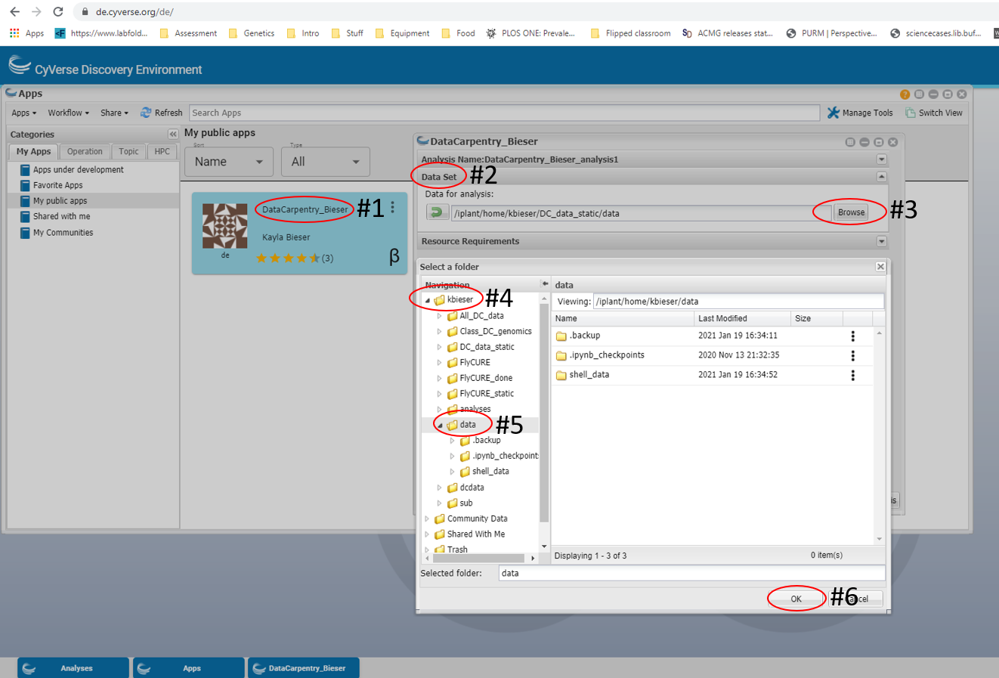

## What is a shell and why should I care?

A *shell* is a computer program that presents a command line interface
which allows you to control your computer using commands entered
with a keyboard instead of controlling graphical user interfaces
(GUIs) with a mouse/keyboard combination.

There are many reasons to learn about the shell:

* Many bioinformatics tools can only be used through a command line interface, or
have extra capabilities in the command line version that are not available in the GUI.
This is true, for example, of BLAST, which offers many advanced functions only accessible
to users who know how to use a shell.  
* The shell makes your work _less boring_. In bioinformatics you often need to do
the same set of tasks with a large number of files. Learning the shell will allow you to
automate those repetitive tasks and leave you free to do more exciting things.  
* The shell makes your work less error-prone. When humans do the same thing a hundred different times
(or even ten times), they're likely to make a mistake. Your computer can do the same thing a thousand times
with no mistakes.  
* The shell makes your work more reproducible. When you carry out your work in the command-line
(rather than a GUI), your computer keeps a record of every step that you've carried out, which you can use
to re-do your work when you need to. It also gives you a way to communicate unambiguously what you've done,
so that others can check your work or apply your process to new data.  
* Many bioinformatic tasks require large amounts of computing power and can't realistically be run on your
own machine. These tasks are best performed using remote computers or cloud computing, which can only be accessed
through a shell.

In this lesson you will learn how to use the command line interface to move around in your file system.

## How to access the shell

Login into CyVerse and navigate to the _DataCarpenty_Bieser_ app. For every session from now on, you will want to launch the app from your own username/data. Since we ran the _Persistence_Notebook_ in the previous lesson, you will have a new folder _data_. To launch the app from your username: 1) Click on the app to open the first window 2) Click on the tab that says _Data Set_ 3) Click on _Browse_ which will open a new window 4) Click the folder with your username 5) Click on the folder titled _data_ 6) Click _OK_ and launch the app. **You will launch the app this way for the entire semester.**

You are now ready to start using the command shell! Once the app is launched, run cell 1 of your _Persistance_Notebook_ and then launch the terminal. You are now ready for the lesson. 

## Navigating your file system

The part of the operating system responsible for managing files and directories
is called the **file system**.
It organizes our data into files,
which hold information,
and directories (also called "folders"),
which hold files or other directories.

Several commands are frequently used to create, inspect, rename, and delete files and directories.

> ## Preparation Magic
>
> If you type the command:
> `PS1='$ '`
> into your shell, followed by pressing the <kbd>Enter</kbd> key,
> your window should look like our example in this lesson.  
> This isn't necessary to follow along (in fact, your prompt may have
> other helpful information you want to know about).  This is up to you! Close your terminal and re-open to restore the terminal back to the original settings.  
{: .callout}

~~~
$
~~~
{: .bash}

The dollar sign is a **prompt**, which shows us that the shell is waiting for input;
your shell may use a different character as a prompt and may add information before
the prompt. When typing commands, either from these lessons or from other sources,
do not type the prompt, only the commands that follow it.

Let's find out where we are by running a command called `pwd`
(which stands for "print working directory").
At any moment, our **current working directory**
is our current default directory,
i.e.,
the directory that the computer assumes we want to run commands in,
unless we explicitly specify something else.
Here,
the computer's response is `/home/gea_user`,
which is the top level directory within our cloud system:

~~~
$ pwd
~~~
{: .bash}

~~~
/home/gea_user
~~~
{: .output}

Let's look at how our file system is organized. We can see what files and subdirectories are in this directory by running `ls`,
which stands for "listing" or "list stuff":

~~~
$ ls
~~~
{: .bash}

~~~
data  downloads.stderr.log  downloads.stdout.log
~~~
{: .output}

`ls` prints the names of the files and directories in the current directory in
alphabetical order,
arranged neatly into columns.

The command to change locations in our file system is `cd`, followed by a
directory name to change our working directory.
`cd` stands for "change directory".

Let's say we want to navigate to the `data` directory where we will find our subdirectory's.

~~~
$ cd data
~~~
{: .bash}

~~~
Persistence_Notebook-KB_3.ipynb  shell_data
~~~
{: .output}

We'll be working within the `shell_data` subdirectory, and creating new subdirectories, throughout this class. We will use the `Persistence_Notebook-KB_3.ipynb` to save our work from class to class which was introduced in the getting started lesson.   

For now, let's navigate to the `shell_data` directory we saw above.  We can
use the following command to get there:

~~~
$ cd shell_data
~~~
{: .bash}

Let's look at what is in this directory:

~~~
$ ls
~~~
{: .bash}

~~~
sra_metadata  untrimmed_fastq
~~~
{: .output}

We can make the `ls` output more comprehensible by using the **flag** `-F`,
which tells `ls` to add a trailing `/` to the names of directories:

~~~
$ ls -F
~~~
{: .bash}

~~~
sra_metadata/  untrimmed_fastq/
~~~
{: .output}

Anything with a "/" after it is a directory. Things with a `*` after them are programs. If
there are no decorations, it's a file.

`ls` has lots of other options. To find out what they are, we can type:

~~~
$ man ls
~~~
{: .bash}

Some manual files are very long. You can scroll through the file using
your keyboard's down arrow or use the <kbd>Space</kbd> key to go forward one page
and the <kbd>b</kbd> key to go backwards one page. When you are done reading, hit <kbd>q</kbd>
to quit.

> ## Exercise
> Use the `-l` option for the `ls` command to display more information for each item
> in the directory. What is one piece of additional information this long format
> gives you that you don't see with the bare `ls` command?
>
> > ## Solution
> > ~~~
> > $ ls -l
> > ~~~
> > {: .bash}
> >
> > ~~~
> > total 8
> > drwxr-sr-x 2 gea_user gea_user 37 Aug  3 23:24 sra_metadata
> > drwxr-sr-x 2 gea_user gea_user 64 Aug  3 23:24 untrimmed_fastq
> > ~~~
> > {: .output}
> >
> > The additional information given includes the name of the owner of the file,
> > when the file was last modified, and whether the current user has permission
> > to read and write to the file.
> >
> {: .solution}
{: .challenge}

No one can possibly learn all of these arguments, that's what the manual page
is for. You can (and should) refer to the manual page or other help files
as needed.

Let's go into the `untrimmed_fastq` directory and see what is in there.

~~~
$ cd untrimmed_fastq
$ ls -F
~~~
{: .bash}

~~~
SRR097977.fastq  SRR098026.fastq
~~~
{: .output}

This directory contains two files with `.fastq` extensions. Notice there is no trailing slash which lets us know that these are files and not directories. FASTQ is a format
for storing information about sequencing reads and their quality.
We will be learning more about FASTQ files in a later lesson.

> ## Tip
>
> If you like to use hot-key combinations you might be interested to know that clearing the console can be achieved by pressing `Ctrl+L`. Feel free to try it and see for yourself. Alternatively, you can type the command `clear` and it will also clear your console.
{: .callout}

### Shortcut: Tab Completion

Typing out file or directory names can waste a
lot of time and it's easy to make typing mistakes. Instead we can use tab complete
as a shortcut. When you start typing out the name of a directory or file, then
hit the <kbd>Tab</kbd> key, the shell will try to fill in the rest of the
directory or file name.

Return to your home directory:

~~~
$ cd
~~~
{: .bash}

then enter:

~~~
$ cd da<tab>
~~~
{: .bash}

The shell will fill in the rest of the directory name for
`data`.

Let's use tab again to get to our `shell_data` directory.

~~~
$ cd she<tab>
~~~
{: .bash}

Now change directories to `untrimmed_fastq` in `shell_data`

~~~
$ cd untrimmed_fastq
~~~
{: .bash}

Using tab complete can be very helpful. However, it will only autocomplete
a file or directory name if you've typed enough characters to provide
a unique identifier for the file or directory you are trying to access.

> ## Tip
>
> If you are hitting tab and the file or directory name is not auto-filling, you may be in the wrong directory. Tab completion will only work if you are in the correct location. Using the tab key is often useful in helping to troubleshoot and understand where you are located.
{: .callout}

If we navigate back to our `untrimmed_fastq` directory and try to access one
of our sample files:

~~~
$ cd
$ cd data
$ cd shell_data
$ cd untrimmed_fastq
$ ls SR<tab>
~~~
{: .bash}

The shell auto-completes your command to `SRR09`, because all file names in
the directory begin with this prefix. When you hit
<kbd>Tab</kbd> again, the shell will list the possible choices.

~~~
$ ls SRR09<tab><tab>
~~~
{: .bash}

~~~
SRR097977.fastq  SRR098026.fastq
~~~
{: .output}

Tab completion can also fill in the names of programs, which can be useful if you
remember the beginning of a program name.

~~~
$ pw<tab><tab>
~~~
{: .bash}

~~~
pwck      pwconv    pwd       pwdx      pwunconv
~~~
{: .output}

Displays the name of every program that starts with `pw`.

## Summary

We now know how to move around our file system using the command line.
This gives us an advantage over interacting with the file system through
a GUI as it allows us to work on a remote server, carry out the same set of operations
on a large number of files quickly, and opens up many opportunities for using
bioinformatic software that is only available in command line versions.

In the next few classes, we'll be expanding on these skills and seeing how
using the command line shell enables us to make our workflow more efficient and reproducible.
